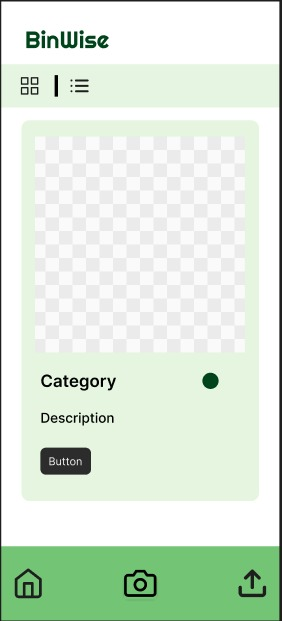
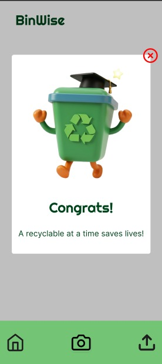

# bin-wise-test
# Goal
- Implement a UI that is as closest to the design files as possible. 
## UI Goal
1. Implement homepage exactly as it is. Take note of color pallete and positioning of icons. Keep in mind this is not a webpage but a simulation of a mobile screen. 
2. After image is captured (uploaded or from camera), provide an immediate preview to the user and below it a CTA Button to clasify image. The user clicking on the CTA Button triggers and event that is handled within API.js in the original project repo. This takes time to load as the model processes the image. Once the data is received, append it to the screen as indicated in the  . Also take note of the card design used in the results page.
3. Provide a Done CTA in the above page. Upon clicking, let it lead the user to a splash screen . Implement this using a modal so that it can be cancelled by the user and return to the home page after this. 

## Logic Steps
1. Complete re-rendering of the interface for each step of the user journey
2. The focus of this repo is only on the frontend UI logic. Nothing done here affects the main logic or API logic and so let them remain untouched. Use a fake object 
```js
const MOCK_RESULT = {
    result: {
        bin: "Recycling (Blue Bin)",
        category: "Plastic Bottle",
        explanation: "This is a PET plastic bottle. Ensure it is empty and the cap is removed before disposal.",
        confidence: 0.985
    }
}
    ```
